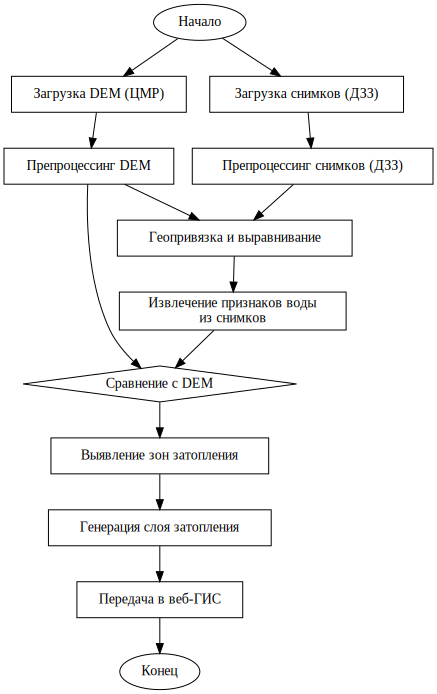

# Геопортал для мониторинга затоплений

**Веб-платформа для анализа, мониторинга и визуализации зон затопления на основе спутниковых снимков и цифровых моделей рельефа (DEM).**

---

## Аннотация

Геопортал реализует полный цикл анализа затоплений: от загрузки данных и автоматической обработки до визуализации и получения статистики. Используются современные алгоритмы гидрологического анализа, машинного зрения и ГИС-технологии. Система поддерживает интерактивную работу с большими объёмами данных, REST API и расширяемую архитектуру.

---

## Введение

Проблема мониторинга и анализа затоплений актуальна для предотвращения ущерба от паводков и ЧС. Данный проект реализует научно-обоснованный и практически применимый инструмент для автоматизации анализа зон затопления на основе спутниковых данных и цифровых моделей рельефа.

---

## Описание и назначение

- Загрузка и хранение DEM и спутниковых снимков
- Автоматический анализ затопления (DEM, MNDWI, сравнение масок)
- Визуализация результатов на интерактивной карте (Leaflet)
- Получение статистики по затопленным территориям
- Сравнение результатов по разным источникам
- Гибкая система ролей и разграничения доступа

---

## Архитектура и структура проекта

- `floodportal/` — основной Django-проект (настройки, маршруты)
- `flooddata/` — приложение для анализа затоплений, загрузки данных, API, бизнес-логика
- `templates/` — HTML-шаблоны (карта, анализ, загрузка, регистрация и др.)
- `static/` — CSS, JS, изображения, иконки
- `media/` — пользовательские файлы (DEM, снимки, результаты анализа)
- `requirements.txt` — полный список зависимостей

---

## Диаграмма классов и блок-схема


- **DEMFile** — хранение исходных и обработанных DEM-файлов
- **FloodAnalysis** — анализ затопления, связывает DEM, снимки, результаты
- **FloodZone, FloodEvent, MeasurementPoint, WaterLevelMeasurement** — дополнительные сущности для расширенного мониторинга

Блок-схема обработки данных:



---

## Алгоритм анализа затопления

1. **Загрузка данных:**  Пользователь загружает DEM-файл (GeoTIFF) и спутниковые снимки (Green, SWIR2).
2. **Извлечение маски воды по снимку:**  Вычисляется индекс MNDWI, формируется бинарная маска воды.
3. **Маска воды по DEM:**  Выделяются потенциальные зоны затопления по высоте и аккумуляции.
4. **Сравнение масок:**  Определяются три зоны: только DEM (осушение), только снимок (затопление), совпадающие зоны.
5. **Векторизация:**  Маски преобразуются в GeoJSON (MultiPolygon).
6. **Расчёт статистики:**  Площади, IoU, pixel-wise accuracy, статистика по районам.
7. **Визуализация:**  Результаты отображаются на карте, доступны для скачивания и анализа.

---

## Научная новизна и особенности

- **Интеграция гидрологической коррекции DEM** (алгоритмы fill_depressions, flow accumulation)
- **Автоматическое сравнение DEM и спутниковых масок** (метрики IoU, pixel-wise accuracy)
- **Гибкая архитектура API** для интеграции с внешними системами (GeoServer, WMS/WFS)
- **Интерактивная визуализация**: быстрый PNG-оверлей и векторные маски на Leaflet
- **Масштабируемость**: поддержка больших данных, асинхронная обработка (Celery, background tasks)

---

## Функциональные возможности

### Для всех пользователей
- Просмотр интерактивной карты с зонами затопления, событий, точек измерения
- Исторические данные, статистика

### Для зарегистрированных пользователей
- Загрузка DEM и спутниковых снимков
- Создание и запуск анализа затопления
- Просмотр и скачивание результатов, статистики

### Для администраторов
- Управление пользователями, анализами, слоями
- Модерация данных, настройка базовых слоёв

---

## Используемые технологии

- **Бэкенд:** Django, Django REST Framework, GeoDjango
- **База данных:** PostgreSQL + PostGIS
- **Геообработка:** GDAL, Rasterio, Geopandas, Pysheds, Shapely, Fiona, matplotlib
- **Очереди задач:** Celery, django-background-tasks, Redis
- **Фронтенд:** Django Templates, Leaflet.js, HTML5, CSS3, JS
- **Интеграции:** (опционально) GeoServer, WMS/WFS

---

## Установка и запуск

### Предварительные требования
- Python <=3.11
- PostgreSQL с расширением PostGIS
- GDAL (>=3.10)
- Visual C++ Build Tools (Windows)

### Установка

1. Клонируйте репозиторий:
   ```
   git clone <URL-репозитория>
   cd flooding
   ```
2. Создайте и активируйте виртуальное окружение:
   ```
   python -m venv .venv
   .venv\Scripts\activate  # Windows
   source .venv/bin/activate  # Linux/Mac
   ```
3. Установите зависимости:
   ```
   pip install -r requirements.txt
   # Для Windows: отдельно установите GDAL wheel
   ```
4. Создайте файл `.env` с настройками (см. пример в readme).
5. Примените миграции и создайте суперпользователя:
   ```
   python manage.py makemigrations
   python manage.py migrate
   python manage.py createsuperuser
   ```
6. Запустите Celery (или background tasks) и сервер:
   ```
   python manage.py process_tasks
   python manage.py runserver
   ```
7. Откройте http://127.0.0.1:8000/

---

## API и интеграции

- REST API для загрузки, анализа, получения результатов (см. flooddata/views.py)
- GeoJSON endpoints для карты (слои затопления, маски, события)
- (Опционально) интеграция с GeoServer через WMS/WFS

### Примеры API-запросов

#### Получить список анализов пользователя
```http
GET /api/flood-analyses/
```

#### Получить маски анализа в формате GeoJSON
```http
GET /api/flood-analysis/<id>/masks-geojson/
```

#### Запустить гидрологическую коррекцию DEM (только для администратора)
```http
POST /api/hydro-correction/
{
  "dem_path": "/media/dem_files/eu_dem_3s.tif"
}
```

---

## Пример использования

1. Зарегистрируйтесь и войдите в систему
2. Загрузите DEM и спутниковые снимки (Green, SWIR2)
3. Создайте анализ затопления, выберите файлы
4. Дождитесь завершения обработки (статус "Завершено")
5. Просматривайте результаты на карте, скачивайте статистику

---

## Зависимости

См. полный список в `requirements.txt`.  
Ключевые библиотеки: Django, djangorestframework, GDAL, rasterio, geopandas, numpy, Leaflet.js и др.

---

## Лицензия

MIT License

---

## Авторы и контакты

- 

---

## Вклад

Pull requests и предложения приветствуются! Открывайте issue или делайте merge request.

---

**Для научных публикаций:**  
Если вы используете этот проект в научных работах, пожалуйста, цитируйте как:  
*Геопортал для мониторинга затоплений: автоматизация анализа и визуализации зон затопления на основе DEM и спутниковых данных, 2025.*

---